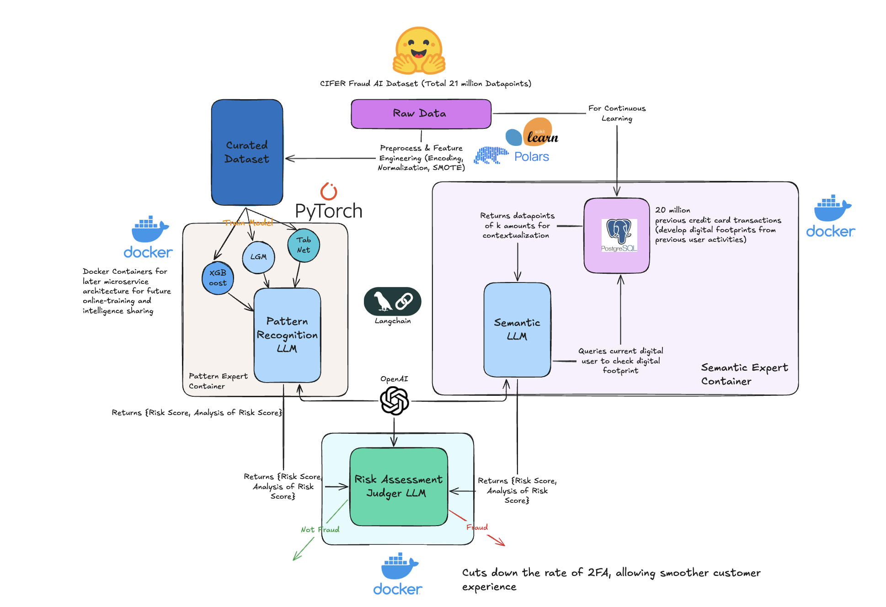

# FinTech-Hackathon

This project is designed to detect bank transaction fraud more effecient and convenient to the user, using advanced models and pipelines to perform [main functionality, e.g., fraud detection, risk assessment, data analysis, etc.].

Here is the overall architecture below:

