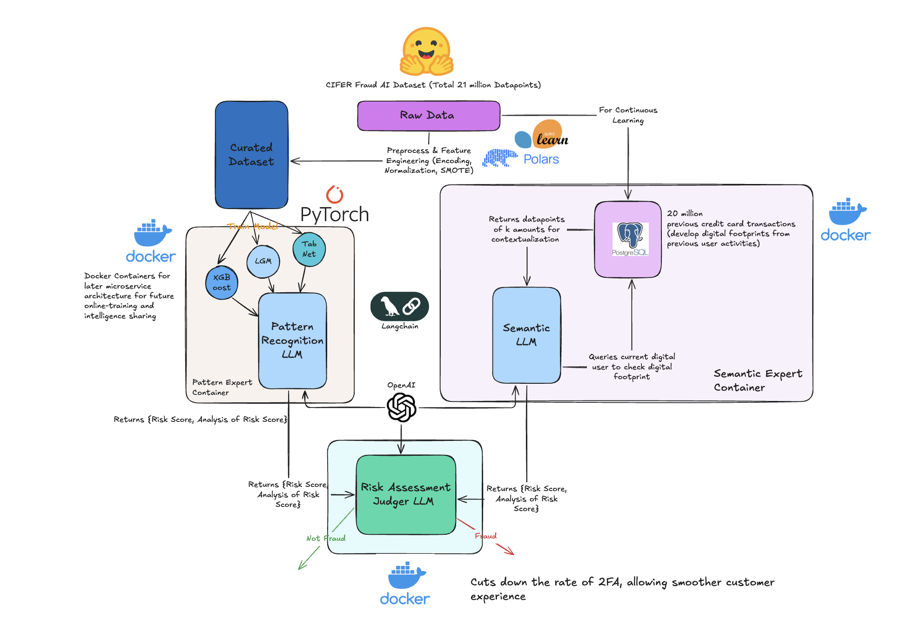

# FinTech-Hackathon

An adversarial, multi-agent fraud detection pipeline for bank transactions. Instead of relying on a single classifier, a transaction is scored by two independent "expert" agents — one reasoning over historical behavioral patterns, one reasoning over semantic/contextual signals — whose findings are reconciled by a decider agent into a final risk score and action. The goal is fewer false positives and less friction (e.g. unnecessary 2FA challenges) for legitimate users, while still catching fraud.

## Architecture



1. **Pattern Expert** (`src/ensemble/`) — an ensemble of gradient-boosted models (XGBoost, LightGBM; a TabNet head is present but currently disabled) trained on the CIFER fraud dataset, producing a numeric risk score from transaction features. An LLM then explains/contextualizes that score.
2. **Semantic Expert** (`src/semantic_agent.py`) — looks up the sender's recent transaction history in PostgreSQL to build a "digital footprint," then uses an LLM to judge how consistent the new transaction is with that history.
3. **Decider Agent** (`src/decider_agent.py`) — an LLM judge that reconciles the pattern and semantic risk scores/analyses into a `final_risk_score` and a decision:
   - `>= 0.7` → Flag for review
   - `>= 0.4` → Require human verification (e.g. 2FA)
   - `< 0.4` → Allow

Each expert is implemented as its own [LangGraph](https://github.com/langchain-ai/langgraph) graph, orchestrated from `main.py`.

## Project structure

```
.
├── app.py                        # Streamlit UI
├── main.py                       # CLI entry point / pipeline wiring
├── requirements.txt              # pip dependencies
├── environment.yml               # conda environment (mirrors requirements.txt)
└── src/
    ├── decider_agent.py          # final risk assessment graph
    ├── semantic_agent.py         # semantic expert graph
    ├── ensemble/
    │   ├── ensemble_agent.py     # pattern expert graph
    │   ├── ensemble_model.py     # weighted XGBoost/LightGBM ensemble
    │   ├── helper/                # preprocessing + metrics helpers
    │   └── models/                # trained model artifacts (.pkl / .pt)
    └── utils/
        ├── database.py           # SQLAlchemy engine/session
        ├── models.py             # `transactions` ORM model
        ├── nodes.py               # LangGraph node implementations
        ├── prompts.py             # LLM prompt templates
        └── states.py              # LangGraph state schemas
```

## Setup

### Prerequisites

- Python 3.13
- A PostgreSQL database containing a `transactions` table (see `src/utils/models.py` for the schema) populated with historical transactions
- An OpenAI API key

### Install dependencies

Using conda:

```bash
conda env create -f environment.yml
conda activate fintech-hackathon
```

Or with pip:

```bash
python -m venv .venv
source .venv/bin/activate
pip install -r requirements.txt
```

### Configure environment variables

Create a `.env` file in the project root (this file is gitignored — never commit it):

```
OPENAI_API_KEY=sk-...
POSTGRES_DB_URL=postgresql://<user>:<password>@<host>/<database>
```

## Usage

### Streamlit UI

```bash
streamlit run app.py
```

Paste a transaction as JSON and click **Analyze Transaction** to see the semantic and pattern analyses plus the final decision.

### CLI

```bash
python main.py
```

Runs the pipeline against the sample transaction defined in `main.py`. To use programmatically:

```python
from main import semantic_pattern_adverserial_analysis

result = semantic_pattern_adverserial_analysis({
    "nameOrig": "C123456789",
    "type": "TRANSFER",
    "amount": 8500.0,
    "oldbalanceOrg": 9000.0,
    "newbalanceOrig": 500.0,
    "nameDest": "C987654321",
    "oldbalanceDest": 10000.0,
    "newbalanceDest": 18500.0,
})
```

## License

MIT — see [LICENSE](LICENSE).
